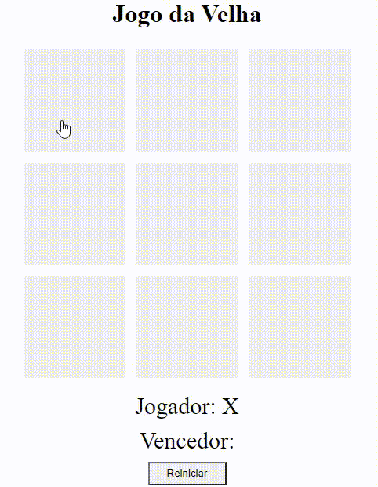

<h2 align="center"><u>Jogo da Velha</u></h2>

 
    

### [+] Description
Criação do jogo da Velha utilizando utilizando somente HTML para estruturar do site, CSS para estilizar e dar vida a ele, e Javascript para criar todas as suas interações, desde a escolha do jogador, efetivar uma jogada e determinar um vencedor do jogo.

### [+] Usage
 - `Para visualizar a página acesse:` 
 <a href="https://livmlop.github.io/JavaScript/Jogo%20da%20Velha/">https://livmlop.github.io/JavaScript/Jogo%20da%20Velha/</a>

### [+] Screenshot
