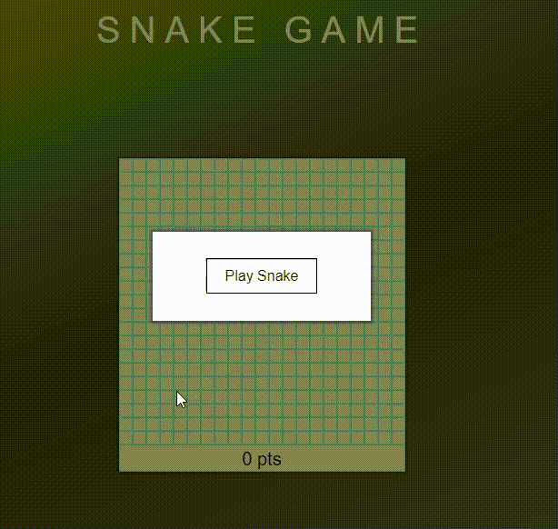

<h2 align="center"><u>Snake Game</u></h2>

 
    

### [+] Description
Reprodução do famoso jogo da cobrinha, nele utilizaremos HTML, CSS e JavaScript, abordando diversos conceitos importantes para programação, como tags HTML, manipulação de eventos, funções e manipulação de elementos HTML usando JavaScript e estilização e animações com CSS e comandos JQuery.

### [+] Usage
 - `Para visualizar a página acesse:` 
 <a href="https://livmlop.github.io/JavaScript/Snake-Game/">https://livmlop.github.io/JavaScript/Snake-Game/</a>

### [+] Screenshot
